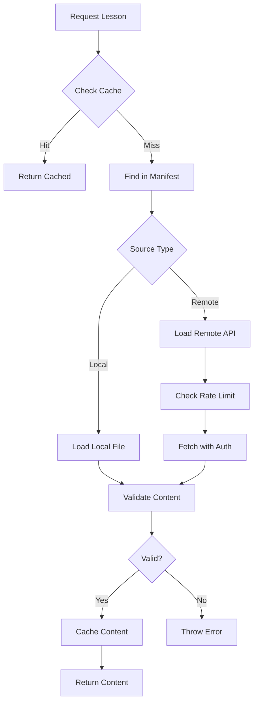

# Lesson Data Architecture

This document describes how PinyinMate manages lesson data from both local and remote sources, including the required schema, data flow, and processing pipeline.

## Overview

PinyinMate supports a flexible lesson data system that can load content from:
- **Local sources**: JSON files stored in the application bundle
- **Remote sources**: External APIs with authentication and rate limiting
- **Mixed sources**: Combinations of local and remote content with intelligent caching

The system provides automatic content validation, text processing, and interactive content generation for Chinese language learning.

## Data Source Configuration

### Remote Sources Configuration

The app configures lesson sources through `src/config/remote-sources.json`:

```json
{
  "sources": [
    {
      "id": "github-hsk",
      "name": "GitHub HSK Lessons",
      "type": "remote",
      "enabled": true,
      "priority": 1,
      "config": {
        "url": "https://raw.githubusercontent.com/chinese-lessons/hsk-content/main/manifest.json",
        "syncInterval": 60,
        "authentication": {
          "type": "bearer",
          "credentials": {
            "token": "github_pat_example"
          }
        }
      }
    }
  ]
}
```

**Key Features:**
- **Authentication**: Support for Bearer tokens and API keys
- **Rate Limiting**: Configurable request limits per time window
- **Sync Intervals**: Automatic content updates
- **Priority System**: Multiple sources with fallback ordering
- **Feature Flags**: Specify supported capabilities (flashcards, quizzes, audio)

### Local Manifest Configuration

Local lessons are defined in `public/lessons/manifest.json`:

```json
{
  "version": "1.0.0",
  "lastUpdated": "2025-09-29T12:00:00Z",
  "categories": [
    {
      "id": "beginner",
      "name": "Beginner Lessons",
      "difficulty": "beginner",
      "totalLessons": 2,
      "lessons": [
        {
          "id": "greetings",
          "title": "Basic Greetings",
          "description": "Learn common Chinese greetings",
          "source": {
            "type": "local",
            "path": "/lessons/beginner/greetings.json"
          },
          "metadata": {
            "difficulty": "beginner",
            "tags": ["greetings", "basic"],
            "characterCount": 45,
            "estimatedTime": 15
          }
        }
      ]
    }
  ],
  "remoteSources": [
    {
      "id": "github-lessons",
      "baseUrl": "https://raw.githubusercontent.com/chinese-lessons/content/main/",
      "rateLimit": {
        "requests": 100,
        "windowMs": 3600000
      }
    }
  ]
}
```

## Lesson Schema Definition

### Required JSON Schema

All lesson files must conform to the schema defined in `schemas/lesson.schema.json`:

```json
{
  "$schema": "http://json-schema.org/draft-07/schema#",
  "title": "PinyinMate Lesson Schema",
  "type": "object",
  "required": ["id", "title", "description", "content", "metadata"],
  "properties": {
    "id": {
      "type": "string",
      "pattern": "^[a-zA-Z0-9-_]+$",
      "minLength": 1,
      "maxLength": 50
    },
    "title": {
      "type": "string",
      "minLength": 1,
      "maxLength": 100
    },
    "description": {
      "type": "string", 
      "minLength": 1,
      "maxLength": 500
    },
    "content": {
      "type": "string",
      "minLength": 1,
      "maxLength": 10000
    },
    "metadata": {
      "type": "object",
      "required": ["difficulty", "tags", "characterCount", "vocabulary"],
      "properties": {
        "difficulty": {
          "type": "string",
          "enum": ["beginner", "intermediate", "advanced"]
        },
        "tags": {
          "type": "array",
          "items": {"type": "string"},
          "minItems": 1,
          "maxItems": 50,
          "uniqueItems": true
        },
        "characterCount": {
          "type": "integer",
          "minimum": 1
        },
        "vocabulary": {
          "type": "array",
          "items": {
            "type": "object",
            "required": ["word", "definition"],
            "properties": {
              "word": {"type": "string"},
              "definition": {"type": "string"}
            }
          }
        },
        "estimatedTime": {
          "type": "integer",
          "minimum": 1,
          "maximum": 300
        }
      }
    }
  }
}
```

### Example Lesson File

```json
{
  "id": "greetings",
  "title": "Basic Greetings",
  "description": "Learn common Chinese greetings and introductions",
  "content": "你好！我是李明。很高兴认识你。你叫什么名字？我来自北京。",
  "metadata": {
    "difficulty": "beginner",
    "tags": ["greetings", "basic", "conversation", "introductions"],
    "characterCount": 45,
    "source": "PinyinMate Sample Content",
    "book": null,
    "vocabulary": [
      {
        "word": "你好",
        "definition": "hello"
      },
      {
        "word": "我是",
        "definition": "I am"
      },
      {
        "word": "很高兴",
        "definition": "very happy/pleased"
      },
      {
        "word": "认识",
        "definition": "to know/meet"
      },
      {
        "word": "叫",
        "definition": "to be called"
      },
      {
        "word": "什么",
        "definition": "what"
      },
      {
        "word": "名字",
        "definition": "name"
      },
      {
        "word": "来自",
        "definition": "to come from"
      },
      {
        "word": "北京",
        "definition": "Beijing"
      }
    ],
    "estimatedTime": 15,
    "createdAt": "2025-09-29T12:00:00Z",
    "updatedAt": "2025-09-29T12:00:00Z"
  }
}
```

## Data Loading Architecture

### Lesson Library Service

The core `LessonLibraryService` (`src/services/lessonLibraryService.ts`) handles:

#### 1. Manifest Loading
```typescript
async loadManifest(): Promise<ContentManifest> {
  const response = await fetch('/lessons/manifest.json');
  const manifestData = await response.json();
  manifestData.lastUpdated = new Date(manifestData.lastUpdated);
  return manifestData;
}
```

#### 2. Smart Caching System
- **LRU Cache**: 100MB limit with automatic eviction of least recently used items
- **TTL Expiration**: Configurable time-to-live per source
- **Size Management**: Automatic cleanup when approaching memory limits

```typescript
class LessonCache {
  private cache = new Map<string, CachedLesson>();
  private readonly maxSize = 100 * 1024 * 1024; // 100MB
  private readonly defaultTtl = 3600000; // 1 hour
  
  get(lessonId: string): LessonContent | null {
    const cached = this.cache.get(lessonId);
    if (!cached || Date.now() > cached.expiresAt.getTime()) {
      return null;
    }
    return cached.content;
  }
}
```

#### 3. Rate Limiting
Prevents API abuse with configurable limits:

```typescript
class RateLimiter {
  canMakeRequest(sourceId: string, limit: number, windowMs: number): boolean {
    const requests = this.getRecentRequests(sourceId, windowMs);
    return requests.length < limit;
  }
}
```

#### 4. Content Validation
Validates lesson structure before caching:

```typescript
const validateLessonContent = (content: unknown): LessonValidationResult => {
  const errors: string[] = [];
  const warnings: string[] = [];
  
  // Required fields validation
  if (!lesson.id || typeof lesson.id !== 'string') {
    errors.push('Lesson must have a valid id');
  }
  
  // Chinese character validation
  const chineseRegex = /[\u4e00-\u9fff]/g;
  const chineseChars = (content.match(chineseRegex) || []).length;
  if (chineseChars === 0) {
    warnings.push('Lesson content does not contain Chinese characters');
  }
  
  return { isValid: errors.length === 0, errors, warnings };
};
```

### Loading Process Flow



## Data Processing Pipeline

### 1. Enhanced Processing Service

The `LessonProcessingService` (`src/services/lessonProcessingService.ts`) provides:

#### Text Segmentation
```typescript
async processLesson(lesson: Lesson, options: LessonProcessingOptions): Promise<ProcessedLessonContent> {
  // Step 1: Text segmentation (sentence, phrase, or character level)
  const segments = await this.segmentLessonText(lesson, options);
  
  // Step 2: Generate pinyin for segments
  const segmentsWithPinyin = await this.addPinyinToSegments(segments);
  
  // Step 3: Vocabulary mapping and enhancement
  const vocabularyMap = await this.buildVocabularyMap(lesson);
  
  // Step 4: Add vocabulary references to segments
  const enhancedSegments = await this.addVocabularyReferences(segmentsWithPinyin, vocabularyMap);
  
  // Step 5: Prepare audio synchronization
  const finalSegments = await this.prepareAudioForSegments(enhancedSegments);
  
  return { segments: finalSegments, vocabularyMap, totalSegments: finalSegments.length };
}
```

#### Vocabulary Enhancement
```typescript
async processVocabulary(lesson: Lesson): Promise<VocabularyEntryWithPinyin[]> {
  const vocabularyEntries: VocabularyEntryWithPinyin[] = [];
  
  for (const vocabEntry of lesson.metadata.vocabulary) {
    const pinyin = await pinyinService.generateBasic(vocabEntry.word);
    const frequency = this.calculateWordFrequency(vocabEntry.word, lesson.content);
    
    vocabularyEntries.push({
      ...vocabEntry,
      pinyin,
      frequency,
      difficulty: this.determineDifficulty(vocabEntry.word, frequency)
    });
  }
  
  return vocabularyEntries;
}
```

### 2. Interactive Content Generation

#### Flashcard Generation
- Automatically creates cards from vocabulary entries
- Supports text-to-speech integration
- Tracks study progress and mastery levels

#### Quiz Generation  
- Multiple choice questions from vocabulary
- Fill-in-the-blank exercises from content
- Grammar point reinforcement activities

## File Organization

### Local Lesson Structure
```
public/lessons/
├── manifest.json              # Master catalog of all lessons
├── beginner/
│   ├── greetings.json        # Individual lesson files
│   ├── family.json
│   └── numbers.json
├── intermediate/
│   ├── weather.json
│   ├── shopping.json
│   └── directions.json
└── advanced/
    ├── business.json
    └── literature.json
```


## Integration with Services

The lesson data flows through multiple specialized services:

1. **LessonLibraryService** - Content loading, caching, and search
2. **LessonProcessingService** - Text analysis and content enhancement
3. **LessonService** - Preparation for learning activities  
4. **TextSegmentationService** - Chinese text parsing using `jieba-js`
5. **PinyinService** - Pronunciation generation with `pinyin-pro`
6. **AudioService** - Speech synthesis and audio management

## Performance Considerations

### Caching Strategy
- **Memory Cache**: 100MB in-memory cache for frequently accessed lessons
- **Session Storage**: Persistent cache across browser sessions
- **Prefetching**: Automatic loading of related lessons
- **Lazy Loading**: On-demand content loading for large libraries

### Rate Limiting
- **Per-source Limits**: Individual quotas for each remote source
- **Window-based**: Rolling time windows for request counting
- **Backoff Strategy**: Exponential delays for failed requests
- **Fallback Sources**: Automatic switching to alternative sources

### Validation Performance
- **Schema Caching**: JSON schema validation cached per lesson type
- **Incremental Validation**: Only validate changed content
- **Background Processing**: Non-blocking validation for large datasets

## Error Handling

### Validation Errors
- **Schema Violations**: Clear error messages with field-specific guidance
- **Content Warnings**: Non-blocking issues that don't prevent usage
- **Graceful Degradation**: Partial functionality when some validation fails

### Network Errors
- **Retry Logic**: Exponential backoff for temporary failures
- **Offline Support**: Cached content available without network
- **Fallback Sources**: Automatic switching to backup endpoints

### Content Errors
- **Missing Files**: Clear error reporting with suggested fixes
- **Malformed JSON**: Detailed parsing error messages
- **Encoding Issues**: Automatic detection and conversion

## Best Practices

### Creating Lesson Content

1. **Use Meaningful IDs**: Choose descriptive, URL-safe identifiers
2. **Include Rich Metadata**: Comprehensive tags, difficulty levels, and timing
3. **Provide Quality Vocabulary**: Include context and part-of-speech information
4. **Add Cultural Context**: Cultural notes enhance learning experience
5. **Optimize Audio**: Segment audio files for interactive playback

### Remote Source Integration

1. **Implement Authentication**: Secure API access with proper credentials
2. **Respect Rate Limits**: Configure appropriate request throttling
3. **Handle Failures Gracefully**: Implement proper error handling and fallbacks
4. **Cache Aggressively**: Minimize API requests through intelligent caching
5. **Validate Content**: Ensure remote content meets schema requirements

### Performance Optimization

1. **Minimize Bundle Size**: Use lazy loading for large lesson libraries
2. **Optimize Images and Audio**: Compress media files appropriately
3. **Implement Prefetching**: Load related content in advance
4. **Monitor Memory Usage**: Track cache size and implement cleanup
5. **Use Service Workers**: Enable offline functionality where possible

This architecture provides a robust, scalable foundation for managing Chinese lesson content while maintaining performance, reliability, and user experience quality.